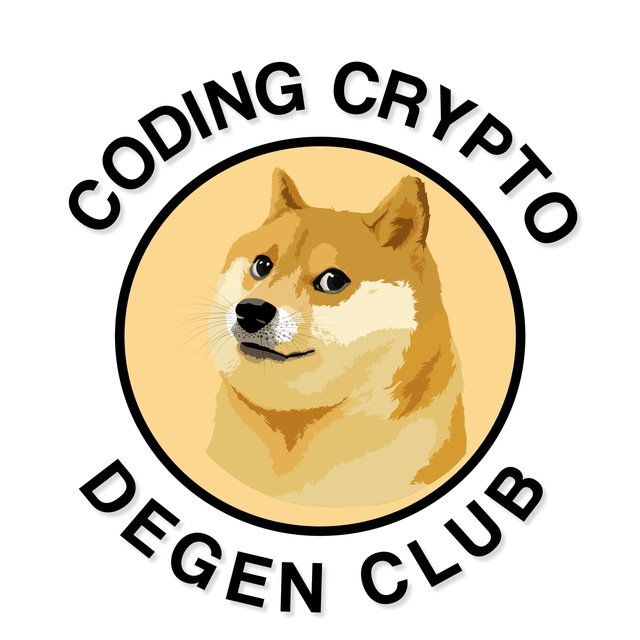

# Neon



## 🔔Join my Telegram community:
CHANNEL: [DegenCoding](https://t.me/degencoding)

## 💻 Requirements

- Python 3.11 or higher
- Funded wallets on the Neon network
- Working proxies (HTTP/SOCKS5)

## 🛠️ Installation
1. **Clone the repository**
   ```bash
   git clone https://github.com/AsheR4444/neon-v2
   ```
2. **Set up a virtual environment**
   ```bash
   virtualenv venv --python=python3.11
   ```
3. **Install dependencies**
   ```bash
   pip install -r requirements.txt
   ```
## ⚙️ Getting Started
1. **Activate the virtual environment** (you need to do this every time before running the script)
    ```bash
    source venv/Scripts/activate  # Windows
    source venv/bin/activate      # Unix/MacOS
    ```
2. **Add wallets**
    1. Run the script:
    ```bash
    python app.py
    ```
    2. In the folder `files` (created after the first run), find the file `import.csv` and fill it out according to the template described in it. You don't need to fill in the private key for the Solana wallet right now, just leave it empty or put a dash (`-`)
    3. Run the script again, enter "1", and press "Enter". The console will display a message indicating that the wallets have been added to the database.
3. In the `files` folder, find the `settings.json` file and type in the required settings.
## 🚀 **Usage**
1. Start the script:
   ```bash
   python app.py
   ```
2. Enter "2" in the console.
